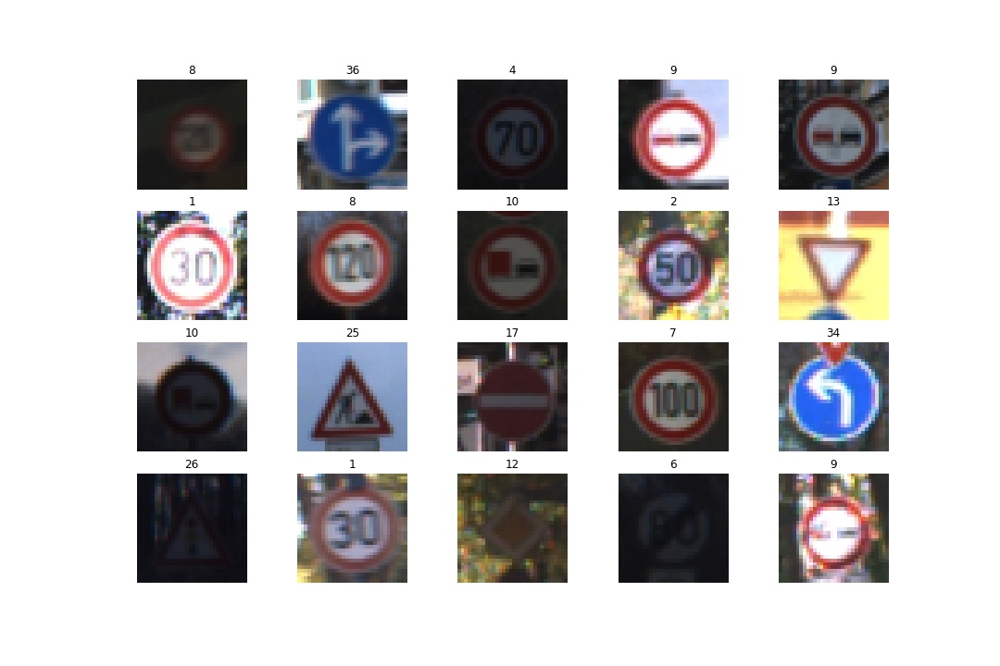

# **Traffic Sign Recognition** 

## Writeup

---

**Build a Traffic Sign Recognition Project**

The goals / steps of this project are the following:
* Load the data set (see below for links to the project data set)
* Explore, summarize and visualize the data set
* Design, train and test a model architecture
* Use the model to make predictions on new images
* Analyze the softmax probabilities of the new images
* Summarize the results with a written report

## Rubric Points
### Here I will consider the [rubric points](https://review.udacity.com/#!/rubrics/481/view) individually and describe how I addressed each point in my implementation.  

---
### Writeup / README

#### 1. Provide a Writeup / README that includes all the rubric points and how you addressed each one. You can submit your writeup as markdown or pdf. You can use this template as a guide for writing the report. The submission includes the project code.

You're reading it! and here is a link to my [project code](https://view5f1639b6.udacity-student-workspaces.com/notebooks/CarND-Traffic-Sign-Classifier-Project/Traffic_Sign_Classifier.ipynb)

### Data Set Summary & Exploration

#### 1. Provide a basic summary of the data set. In the code, the analysis should be done using python, numpy and/or pandas methods rather than hardcoding results manually.

I used the numpy library to calculate summary statistics of the traffic
signs data set:

* The size of training set is 34799
* The size of the validation set is 4410
* The size of test set is 12630
* The shape of a traffic sign image is (32,32,3)
* The number of unique classes/labels in the data set is 43

#### 2. Include an exploratory visualization of the dataset.

Here is an exploratory visualization of the data set. I first display 20 random images with their Class IDs from the training set and followed by a hisogram of the training set, with Class ID on the x axis and number/frequency of the traffic sign belonging to that class ID on the y axis depicted by a bar graph.

### Design and Test a Model Architecture

#### 1. Describe how you preprocessed the image data. What techniques were chosen and why did you choose these techniques? Consider including images showing the output of each preprocessing technique. Pre-processing refers to techniques such as converting to grayscale, normalization, etc. (OPTIONAL: As described in the "Stand Out Suggestions" part of the rubric, if you generated additional data for training, describe why you decided to generate additional data, how you generated the data, and provide example images of the additional data. Then describe the characteristics of the augmented training set like number of images in the set, number of images for each class, etc.)

I wrote my own routine image_augmentation.py in order to define functions for augmenting data. 

As is evident from the histogram (above), the classes are not balanced and one of the objectives here is to balance the classes and generate more of fake data using the existing data.

The routine defines functions like rotate_randomly, add_noise_randomly, translate, rescale_image, and flip image left-to-right and upside-down. 

I use rotate_randomly, translate and crop functions to augment the images below. A sample of image augmentation is shown below with both the original image and it's augmented counterparts of the traffic sign: Speed Limit (50kmph)

I automated the process for augmenting images in the codecell below the heading "Generating additional augmented images to be used for training".

I choose an upper limit (900) as the frequency for each class. More fake images would be generated for any class which has samples less than 900. This trick is to ensure the classes are balanced. The upperlimit was chosen after an iterative process to see what number gives the best accuracy for the validation data. This additional data was appended to the original training set which results in not only a bigger training set but also a more balanced one. 

The histogram below shows the balanced classes where the frequency of most of the classes is same and is equal to 900. This balancing also avoids the biasing in the model to predict a particular sign more often and have an unbaised set of learned parameters.

Once the training set is balanced, I proceeded with the rest of preprocessing techniques like grayscale and batch normalization.

First I converted the dataset in to gray scale images as implemented in the code cell below the heading "Convert to gray scale". The image below shows random 20 images after converting the data set to gray scale with only one channel. It helps to reduce the number of channels of an image to just one since the problem of traffic sign classifier can be described as a color invariant. 

As a last step, I normalized the image data because it makes the case for a stable convergence of the gradient descent algorithm. This is implemented in the code cell below the heading "Applying normalization to the dataset".

#### 2. Describe what your final model architecture looks like including model type, layers, layer sizes, connectivity, etc.) Consider including a diagram and/or table describing the final model.

My final model consisted of the following layers: (Reference: Yan Le Cunn's paper)

| Layer         		|     Description	        				                    	| 
|:---------------------:|:-----------------------------------------------------------------:| 
| Input         		| 32x32x3 RGB image   						                    	| 
| L1 :Convolution 5x5  	| 1x1 stride, VALID padding, outputs 28x28x6                    	|
| RELU(L1)				|								                    				|
| Max pooling (L1)    	| filter 2x2, stride 2, input 28x28x6  output 14x14x6 				|
| L2 :Convolution 5x5   | input 14x14x6, output 10x10x16   									|
| RELU(L2)				|								                    				|
| Max pooling (L2)    	| filter 2x2, stride 2, input 10x10x16  output 5x5x16 				|
| L3 :Convolution 5x5   | input 5x5x16, output 1x1x400   									|
| RELU(L3)				|								                    				|
| Flatten L2 and L3 	| Both L2 and L3 have size 400	                    				|
| Concatenate(L2,L3)	| Concatenate flattened Layers 2 and 3, output 400+400=800			|
| Dropout				| keep_prob = 0.5                									|
| Fully Connected L4	| input 800, output 43												|
| Logits				| output of Fully Connected Layer 4									|

#### 3. Describe how you trained your model. The discussion can include the type of optimizer, the batch size, number of epochs and any hyperparameters such as learning rate.

The model uses AdamOptimizer for both LeNet and Stage_2_LeNet. Following values were used for the hyperparameters:

   * BATCH_SIZE: 100
   * EPOCHS: 60
   * Learning rate: 0.0010
   * mu(mean) = 0.0
   * sigma(SD) = 0.1
   * dropout(keep_prob) = 0.5

As such these parameters were fixed after trying out a lot of different while tuning the hyperparameters.

#### 4. Describe the approach taken for finding a solution and getting the validation set accuracy to be at least 0.93. Include in the discussion the results on the training, validation and test sets and where in the code these were calculated. Your approach may have been an iterative process, in which case, outline the steps you took to get to the final solution and why you chose those steps. Perhaps your solution involved an already well known implementation or architecture. In this case, discuss why you think the architecture is suitable for the current problem.

My final model results were:
* validation set accuracy of 95%  calculated under the heading "Training the model".
* test set accuracy of 93.1% caluclated under the heading "Evaluate accuracy on the test data".
* New set accuracy of 100% calculated under the heading "Predict the Sign Type for Each Image".

The suggested direction to approach this problem in the LeNet lecture was to first use the LeNet model architecture as it is (plug and play) and try to get the validation accuracy of 0.89. I started with the LeNet Model and achielved the same accuracy after tuning the hyperparameters. The aarchitecture for the LeNet model is also provided below.

After that I read the Yann LeCun's paper on Convolutional Neural Network which describes another model architecture for 2 stage ConvNet where during the feed-forward phase, the input goes through 2 layers of convolutions and subsampling and then to the classifier. The output of stage 1 is also fed to the classifier.

Implementing the second model improved the accuracy to more than 93% which is the requirement of this project for successful submission. The validation accuracy oscillates near 95% and the test accuracy is 93.1%.

First Model to be used (LeNet model):

| Layer         		|     Description	        				                    	| 
|:---------------------:|:-----------------------------------------------------------------:| 
| Input         		| 32x32x3 RGB image   						                    	| 
| L1 :Convolution 5x5  	| 1x1 stride, VALID padding, outputs 28x28x6                    	|
| RELU(L1)				|								                    				|
| Max pooling (L1)    	| filter 2x2, stride 2, input 28x28x6  output 14x14x6 				|
| L2 :Convolution 5x5   | input 14x14x6, output 10x10x16   									|
| RELU(L2)				|								                    				|
| Max pooling (L2)    	| filter 2x2, stride 2, input 10x10x16  output 5x5x16 				|
| Flatten L2        	| L2 has a size of 400	                            				|
| Fully Connected L1    | input400 , output 120         									|
| RELU(FCL_1)			|								                    				|
| Dropout				| keep_prob = 0.5                									|
| Fully Connected L2	| input 120, output 84												|
| RELU(FCL_2)			|								                    				|
| Dropout				| keep_prob = 0.5                									|
| Fully Connected L3	| input 84, output 43												|
| Logits				| output of Fully Connected Layer 3									|

* What were some problems with the initial architecture?

I could not ramp up the validation accuracy after trying a large range of hyperparameters on the LeNet model. Better results were obtained once the data augmentation techniques were used with the initial (LeNet) architecture. In the LeNet model, only the high level features from the last stage is fed to the classier and the model does not make use of the low level features. This was adjusted in the 2 stage LeNet model.

* How was the architecture adjusted and why was it adjusted? Typical adjustments could include choosing a different model architecture, adding or taking away layers (pooling, dropout, convolution, etc), using an activation function or changing the activation function. One common justification for adjusting an architecture would be due to overfitting or underfitting. A high accuracy on the training set but low accuracy on the validation set indicates over fitting; a low accuracy on both sets indicates under fitting.

In the new model, we not only use the high level features from the last stage but the output of the first stage(after pooling/subsampling) is also fed to the classifier. This produced higher validation accuracy than before. As described in [Traffic SIgn Recognition with Multi-Scale Convolutional Networks](http://yann.lecun.com/exdb/publis/pdf/sermanet-ijcnn-11.pdf), the second stage is responsible to draw out "global" and invariant shapes and structures, whereas the first stage draws out "local" motifs with more precise details. The final model architecture is desribed above in section 2.  

* Which parameters were tuned? How were they adjusted and why?

Following values were used for the hyperparameters:

* BATCH_SIZE: 100
* EPOCHS: 60 
* Learning rate: 0.0010
* mu(mean) = 0.0
* sigma(SD) = 0.1
* dropout(keep_prob) = 0.5

As such these parameters were fixed after trying out a lot of different while tuning the hyperparameters. In addition to these parameters, another parameter, the upper limit (in data augmentation routine) to generate more fake data upto a threshold was also tuned with hit and trial and arrived at 900 after an iterative process. 
The parameters were adjusted based on the validation accuracy obtained after training. 

* What are some of the important design choices and why were they chosen? For example, why might a convolution layer work well with this problem? How might a dropout layer help with creating a successful model?

The design choices were to use the output of all stages to be fed into the classifier. A convolutional Network is capable of learning multiple stages of invariant features. Each layer is composed of a filter bank layer, anonlinear activation function, and a spatial feature pooling layer. The spatial pooling layer makes the representation robust to distortions and shifts present in the images. A dropout layer is responsible for regularization and reducing overfitting.

If a well known architecture was chosen:
* What architecture was chosen?

A 2 stage ConvNet architecture was chosen

* How does the final model's accuracy on the training, validation and test set provide evidence that the model is working well?
 
 Once the model was trained and used to evaluate the validation set, an accuracy of as high as 95%. After that the evaluation on the test set produced an accuracy of 93.1% and yet after that, the accuracy on a completely new set (real world data) was 100%. This suggests that the model is working well on the new data. 

### Test a Model on New Images

#### 1. Choose five German traffic signs found on the web and provide them in the report. For each image, discuss what quality or qualities might be difficult to classify.

Here are eight German traffic signs that I found on the web: (I used 8 instead of 5)

#### 2. Discuss the model's predictions on these new traffic signs and compare the results to predicting on the test set. At a minimum, discuss what the predictions were, the accuracy on these new predictions, and compare the accuracy to the accuracy on the test set (OPTIONAL: Discuss the results in more detail as described in the "Stand Out Suggestions" part of the rubric).

Here are the results of the prediction:

| Image			        |     Prediction	        					| 
|:---------------------:|:---------------------------------------------:| 
| Keep Left      		| Keep Left   									| 
| Speed Limit(20kmph)	| Speed Limit(20kmph)							|
| Yield					| Yield											|
| Speed Limit(30kmph)	| Speed Limit(30kmph)			 				|
| Children crossing		| Children crossing    							|
| Turn left ahead		| Turn left ahead    							|
| Roundabout mandatory	| Roundabout mandatory 							|
| Speed Limit(100kmph)  | Speed Limit(100kmph) 							|

The model was able to correctly guess 8 of the 8 traffic signs, which gives an accuracy of 100%. This is far better when compared to the accuracy on the test set of 93.1%.

#### 3. Describe how certain the model is when predicting on each of the five new images by looking at the softmax probabilities for each prediction. Provide the top 5 softmax probabilities for each image along with the sign type of each probability. (OPTIONAL: as described in the "Stand Out Suggestions" part of the rubric, visualizations can also be provided such as bar charts)

The code for making predictions on my final model is located in the cell with heading "Predict the Sign Type for Each Image" in the Ipython notebook.

The model is absolutely sure about all the 8 images. The top five softmax probabilities are shown below for each image in the new dataset.

| Probability         	|     Prediction	        					| 
|:---------------------:|:---------------------------------------------:| 
| 1.0,0,0,0,0  			| Keep Left   									| 
| 1.0,0,0,0,0			| Speed Limit (20kmph)							|
| 1.0,0,0,0,0			| Yield											|
| 1.0,0,0,0,0  			| Speed Limit (30kmph)			 				|
| 1.0,0,0,0,0		    | Children crossing   							|
| 1.0,0,0,0,0		    | Turn left ahead      							|
| 1.0,0,0,0,0		    | Roundabout mandatory 							|
| 1.0,0,0,0,0		    | Speed Limit (100kmph)							|
